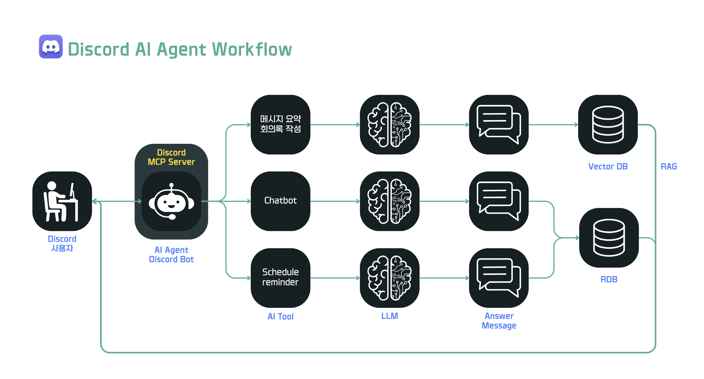
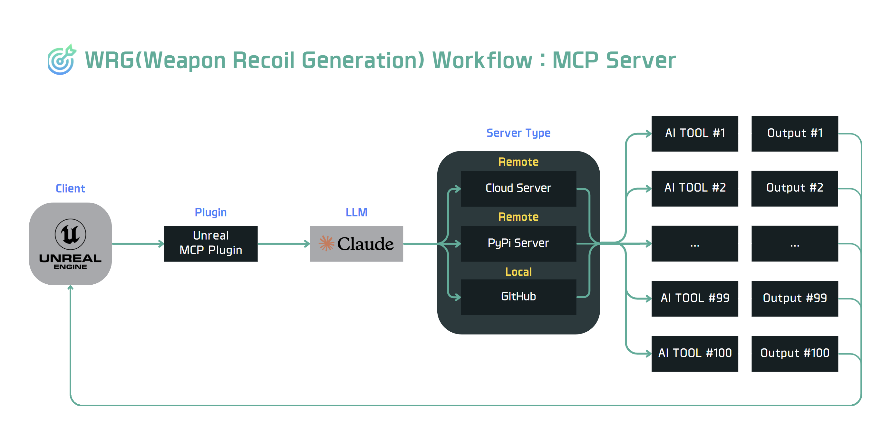
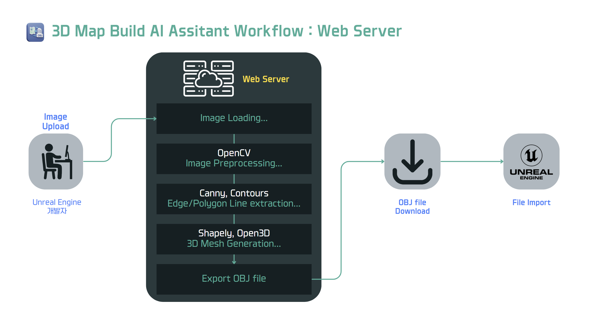

# VALORITHM (발로리즘)
## MCP 기반 AI Agent & AI Tools를 활용한 언리얼 융합 개발 팀 프로젝트
### 팀 구성
- **AI Engineers** : 김형섭, 이성복, 김형후
- **Unreal Engine Developers** : 이충헌, 최연택, 김병대, 김희연

### 프로젝트 기간
- 2025.04.04 ~ 2025.06.05
- <a href="https://www.notion.so/PotenUP-Project-5_Valorithm-1cf33c1194e8809a9512c785febf41f8?pvs=4">협업 기록(Notion)</a>

---

## 1. 프로젝트 개요
**Valorithm**은 AI 엔지니어 3명과 언리얼 엔진 개발자 4명이 협업하여 제작 중인 차세대 FPS 게임 개발 프로젝트입니다.  
본 프로젝트는 MCP 기반의 AI Agent 및 AI Tool을 직접 설계·구현함으로써, 언리얼 엔진 에디터 환경에서의 게임 개발 워크플로우를 혁신하고, 플레이어에게 몰입감 높은 인게임 AI 경험을 제공하는 것을 목표로 합니다.
AI 기술이 프로젝트 기획부터 개발, 플레이 환경 전반에 걸쳐 유기적으로 통합되도록 설계되었으며 개발 효율성과 사용자 경험을 동시에 향상시키는 새로운 게임 제작 패러다임을 제시합니다.

### AI 기능 설명

- 🧠**기능.1** : 프로젝트 기획 과정에서, **회의록 정리와 일정 리마인더를 도와주는 Discord MCP기반의 AI Agent**
- 🌀**기능.2** : 프로젝트 개발 과정에서, 무기의 총기 궤적을 **자연어 명령을 통해 생성하고 시각화해주는 MCP 기반의 AI Tool**
- 🛠️**기능.3** : 프로젝트 개발 과정에서, **2D 이미지 한장을 3D Mesh 맵으로 변경 생성**해주는 Web Server 기반의 AI Tool
- 🎮**기능.4** : 프로젝트 사용 과정에서, 유저를 위한 게임 규칙, 설정의 이해를 돕는 **LangGraph 기반의 AI Agent "Javis"**

- <a href="https://www.canva.com/design/DAGoJUcpX6I/U_m7ITH1VmmHDcPLT7uVIg/view?utm_content=DAGoJUcpX6I&utm_campaign=designshare&utm_medium=link2&utm_source=uniquelinks&utlId=hf2c64f3906">프로젝트 프레젠테이션 자료</a>

---

## 2. 핵심 AI 기능 상세 설명

### 🧠 회의 요약 및 일정 리마인더 AI Agent (Discord MCP 기반)  
- Smithery.ai에 있는 Discord MCP Server를 활용하여, 채팅 로그를 수집하고 분석하는 AI Chatbot 개발  
- LLM(Claude)과 연동하여 텍스트 분석 및 요약 기능 설정.
- 프로젝트를 기획하는 협업 Tool을 Discord로 설정하고, 채널을 개설 후 Chatbot을 초대하면 나눴던 대화 내용을 자동으로 분석 및 요약
- 프로젝트 도메인에 맞게 설정되어, 사용자가 질문하면 맞춤형 피드백을 제공
- 지정된 시간(AM 10:25)에 지난 24시간 동안의 대화 내용을 용도에 따라 RDB(Oracle), Vector DB(ChromaDB)에 저장하고 채팅창에 회의록과 리마인더 작성.  
- 향후 Slack, Notion 등 협업 관리 시스템과의 연동 기능도 개발 고려 중.
- **Work FlowChart**

---

### 🌀 무기 반동 궤적 생성 (Weapon Recoil Generation)  
- 총기 종류별(권총, 기관총, 산탄총 등) 반동 궤적을 자동 생성하는 MCP Server 기반 AI Tool.
- NumPy를 기반으로 반동의 난수 시드값을 바탕으로 x/y 좌표 시퀀스를 생성.
- Matplotlib을 활용해 시각적으로 생성된 난수의 궤적 검토 가능.
- MCP Server와 연동 된 Host에 자연어로 명령어를 입력하면 결과 출력 가능.
- `Unreal MCP Plugin`을 통해 언리얼 엔진과의 연동 가능.
- 연동이 완료되면 LLM 모델(ex. Claude)등을 통해 언리얼 에디터 상에서 직관적 사용 가능.
- 🔗<a href="https://github.com/Hyeongseob91/mcp-server.git">Smithery.ai MCP Server GitHub</a>
- 🔗<a href="https://smithery.ai/server/@Hyeongseob91/mcp-server">Smithery.ai MCP Server</a>
- **Work FlowChart**

---

### 🛠️ 2D → 3D 맵 변환 AI Tool (Web Server 기반)
- OpenCV 기능을 통해, `.obj` 파일을 생성하여 언리얼 엔진에서 Import하면 3D Mesh Map으로 생성해주는 AI Tool.  
- 2D Image가 Upload되면 Canny, Contours 모델로 윤곽선 및 폴리선을 추출.
- 추출 된 Line을 Shapely, Open3D 모델로 3D Mesh Generation 생성.
- 이후 하나의 폴더로 압축하여 Download 받을 수 있는 방식.
- **Work FlowChart**

---

### 🎮 LangGraph 기반 사용자용 AI 설명 Agent "Javis" (진행 중)
- 게임 내 게임 가이드, 규칙, 특징 등 AI 설명 도우미 역할  
- LangGraph + RAG 기반으로 설계되어 멀티턴 대화 및 조건 분기 처리 가능  
- 게임 내 규칙, 미션 설명, 캐릭터 능력 등 다양한 정보를 사용자 맞춤형으로 제공  
- 외부 지식 소스를 연결하여 RAG 구조로 구성되며, ChromaDB에 벡터 저장  
- 향후 음성 입력 및 출력 기능도 포함될 예정  

---

## 3. 기술 스택

### ⚙️ Frameworks & Libraries
- **LLM**: Claude, LangGraph, RAG
- **AI 분석 및 모델링**: NumPy, Matplotlib, OpenCV, Shapely, Open3D, Canny
- **서버 및 API 구성**: FastAPI, Streamlit, Smithery MCP Server

### 🗂️ Database
- **ChromaDB**: VectorDB(RAG PipeLine)
- **Oracle RDB**: 일정/회의 관리용 구조화 데이터 저장

### ☁️ 배포 및 협업 인프라
- **Docker**: MCP 서버 및 웹 툴 환경 컨테이너화
---

## 4. 게임 개발자 & 게임 사용자 활용 시나리오

### 🎮 게임 개발자 시나리오

### 👤 게임 사용자 시나리오

---

## 5. 설치 및 실행 방법

---
